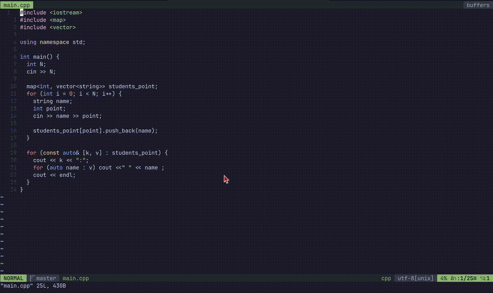

# cppref 
C++の日本語リファレンスを参照するプラグインです



## Requirements
- Vim 9+
- fzf
- cpprefjp を Markdown 化したもの
- glow

## Installation

### vim-plug

```vim
call plug#begin()

Plug 'taka-chin/cppref'

call plug#end()
```

## Setup

```vim
let g:cppref_root = expand('~/.local/share/cpprefjp-md')
let g:cppref_split_width = 82

nmap <Leader>k <Plug>(cppref-open)
```

## Usage

カーソルを `lower_bound` に合わせて

```
<Leader>k
```

を押す
